<!-- ═══════════════════════════════════════════════════════════════
     RUDRA PRASAD BARADA — GitHub Profile README
     Theme-aware hero banner + complete profile
     ═══════════════════════════════════════════════════════════════ -->

<!-- ==================== HERO BANNER ==================== -->
<picture>
  <source media="(prefers-color-scheme: dark)" srcset="./dark.svg">
  <source media="(prefers-color-scheme: light)" srcset="./light.svg">
  
</picture>

 

<!-- ==================== BADGES ==================== -->

---

<!-- ==================== ABOUT ==================== -->
## 💫 About

As an **AI-Native Full-Stack Developer** and the **University AI Hackathon '25 Champion**, I build scalable, AI-driven applications that solve real-world problems. My current focus is on sharpening my full-stack expertise while exploring new frontiers in AI-powered tools.

I'm actively seeking to collaborate on **open-source projects** — particularly those at the intersection of AI and human-centric design. I'm deepening my understanding of advanced system design, ethical AI practices, and strategies for scaling applications to an enterprise level.

---

<!-- ==================== FOCUS ==================== -->
## 🎯 Focus Areas

| Domain | What I Work On |
|--------|----------------|
| **AI / ML** | TensorFlow, scikit-learn, OpenCV, PyTorch, NumPy |
| **Full-Stack** | Next.js, React, Vue.js, TypeScript, Node.js, Express.js |
| **Backend & Data** | MongoDB, PostgreSQL, Prisma, GraphQL, REST APIs |
| **Cloud & DevOps** | Google Cloud, Netlify, Vercel, Docker, GitHub Actions |
| **System Design** | Scalable architecture, enterprise patterns, ethical AI |

---

<!-- ==================== TECH STACK ==================== -->
## 💻 Engineering Stack

**Frontend & UI**

**Backend & Databases**

**AI / ML**

**Cloud & DevOps**

---

<!-- ==================== FEATURED PROJECTS ==================== -->
## 🚀 Featured Projects

<table>
  <tr>
    <td width="50%" valign="top" align="center">
      <h3>🏥 Hospital Care Portal</h3>
      
A comprehensive patient care portal built with <b>Next.js</b> + <b>TypeScript</b>. 
      Centralised platform to manage and access complete healthcare information.

      

        
        
        
      

      
    </td>
    <td width="50%" valign="top" align="center">
      <h3>⭐ Store Rating Platform</h3>
      
Full-stack <b>Next.js</b> + <b>TypeScript</b> app where users rate &amp; review stores. 
      Dedicated dashboards for users, store owners, and admins.

      

        
        
        
      

      
    </td>
  </tr>
  <tr>
    <td width="50%" valign="top" align="center">
      <h3>🌊 Blue Carbon Registry (MRV)</h3>
      
Monitoring, Reporting &amp; Verification system for blue carbon ecosystems. 
      Built with <b>TypeScript</b> for transparent climate data tracking.

      

        
        
      

      
    </td>
    <td width="50%" valign="top" align="center">
      <h3>🤖 R-69 (This Profile)</h3>
      

        
      

      
Animated AI-companion SVG + interactive profile dashboard. 
      Won <b>1st place</b> at University AI Hackathon '25.

      

        
        
      

      
      
    </td>
  </tr>
</table>

  
  

---

<!-- ==================== GITHUB ACTIVITY ==================== -->
## 📈 GitHub Activity

 

<picture>
  <source media="(prefers-color-scheme: dark)" srcset="https://raw.githubusercontent.com/rudraprasad69/rudraprasad69/output/github-contribution-grid-snake-dark.svg" />
  <source media="(prefers-color-scheme: light)" srcset="https://raw.githubusercontent.com/rudraprasad69/rudraprasad69/output/github-contribution-grid-snake.svg" />
  
</picture>

 

---

<!-- ==================== SKILL ARCHITECTURE ==================== -->
## 🎯 Skill Architecture

  
<b>🎨 Frontend &amp; UI</b>

   
  

    
  

  
<i>Building polished, accessible UIs with Next.js / React / Vue. State managed with Redux. Styled with Tailwind / SASS.</i>

  
<b>⚙️ Backend &amp; APIs</b>

   
  

    
  

  
<i>REST + GraphQL APIs on Node.js / Express. MongoDB primary, Prisma ORM for relational layers.</i>

  
<b>🤖 AI / ML</b>

   
  

    
  

  
<i>TensorFlow + scikit-learn for model dev, OpenCV for computer vision, PyTorch for research-grade work.</i>

  
<b>☁️ DevOps &amp; Cloud</b>

   
  

    
  

  
<i>Deployments on GCP / Netlify / Vercel. Containerized with Docker. CI/CD via GitHub Actions.</i>

  
<b>🛠️ Tooling</b>

   
  

    
  

---

<!-- ==================== ANIME CORNER ==================== -->
## 🌸 Anime Corner

  
<b>🍥 What I'm watching &amp; what shaped me</b>

   
  <table>
    <tr><td>📺 <b>Currently watching</b></td><td><i>Frieren: Beyond Journey's End</i></td></tr>
    <tr><td>🌟 <b>All-time favorites</b></td><td>Steins;Gate · Code Geass · Vinland Saga · Death Note · FMA: Brotherhood</td></tr>
    <tr><td>👤 <b>Favorite character</b></td><td>Lelouch vi Britannia — strategy is the highest form of art</td></tr>
    <tr><td>🎯 <b>Why anime + code?</b></td><td>Same reason I love system design — beautiful storytelling at scale</td></tr>
    <tr><td>⚔️ <b>Coding power-up</b></td><td>Lo-fi anime soundtracks while debugging at 2 AM</td></tr>
  </table>

  
<b>💬 Quotes that hit different</b>

   
  <blockquote>
    
"The world isn't perfect. But it's there for us, doing the best it can. That's what makes it so damn beautiful." — <i>Roy Mustang, FMA: Brotherhood</i>

  </blockquote>
  <blockquote>
    
"If you don't take risks, you can't create a future." — <i>Monkey D. Luffy, One Piece</i>

  </blockquote>
  <blockquote>
    
"It's not the face that makes someone a monster, it's the choices they make with their lives." — <i>Naoki Urasawa, Monster</i>

  </blockquote>

  
<b>🎮 Anime ↔ Engineering Mapping</b>

   
  <table>
    <tr><th>Anime concept</th><th>Engineering equivalent</th></tr>
    <tr><td>Nen / Stand abilities</td><td>Type systems &amp; constraints</td></tr>
    <tr><td>Geass / Death Note rules</td><td>API contracts &amp; preconditions</td></tr>
    <tr><td>El Psy Kongroo (Steins;Gate)</td><td>Idempotent commits &amp; rollbacks</td></tr>
    <tr><td>Plus Ultra! (MHA)</td><td>Stretch goals &amp; performance budgets</td></tr>
    <tr><td>Hashira training (Demon Slayer)</td><td>Deliberate practice &amp; code review</td></tr>
  </table>

---

<!-- ==================== QUOTE ==================== -->
## 💭 Quote of the Day

---

<!-- ==================== CONNECT ==================== -->
## 🤝 Let's Build Something Together

I'm actively seeking **open-source collaboration** at the intersection of AI and human-centric design. 
Working on something interesting? Let's talk. 🚀

  

---

<!-- ==================== FOOTER ==================== -->

<!-- Proudly created with the Premium GitHub Profile System -->
